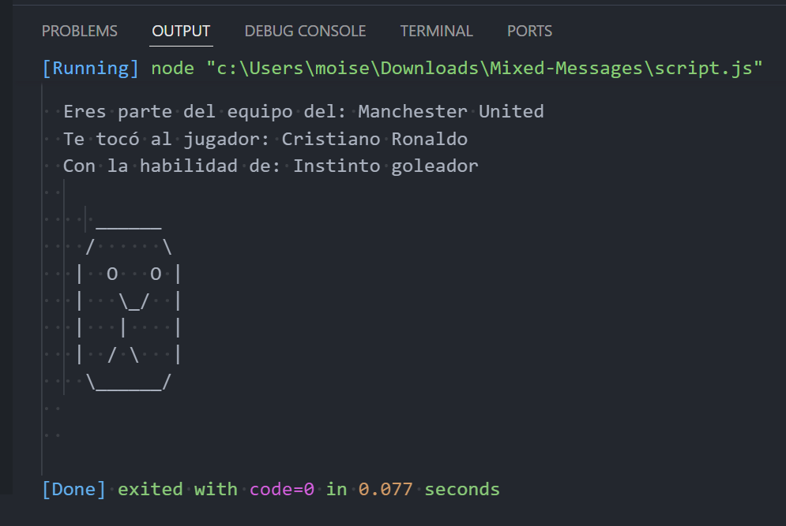

# Mixed-Messages

Para este proyecto, he creado un programa generador de mensajes. Cada vez que un usuario ejecute un programa, debería obtener un nuevo resultado aleatorio. Puedes llevar el proyecto a diferentes formas, como un generador de astrología, un mensaje inspirador o chistes sin sentido. Para que tu programa sea verdaderamente aleatorio, el mensaje que genere debería estar compuesto por al menos tres datos diferentes. He utilizado lo que sé de la sintaxis de JavaScript hasta ahora para crear el programa y personalizarlo a mi gusto.

